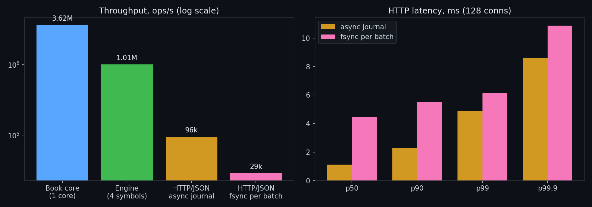
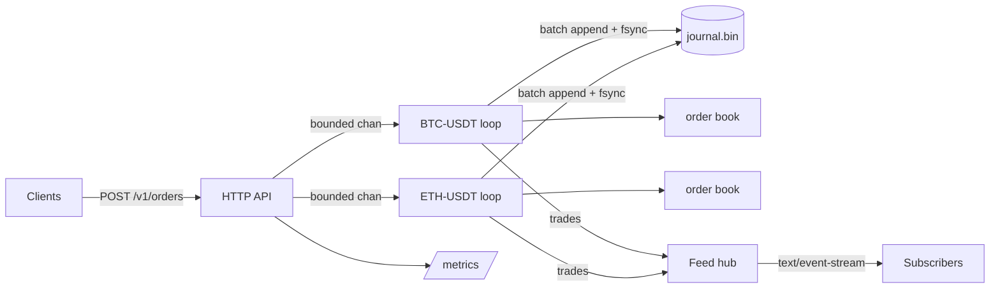

# orderbook-engine

A limit order book and matching engine in Go, built the way exchanges build them: one single-writer loop per instrument, an append-only journal with group commit, and a market data stream that can never slow matching down.




| Layer | Result | How it was measured |
|---|---|---|
| Book core | **3.62M orders/s**, 0 allocs/op | `go test -bench SubmitMixed`, one core |
| Engine, 4 symbols | **1.01M commands/s** | `go test -bench EngineParallel`, 16 goroutines |
| HTTP/JSON, async journal | **95.6k req/s**, p99 4.9 ms | `cmd/loadgen`, 128 keep-alive conns, same laptop |
| HTTP/JSON, fsync every batch | **28.9k req/s**, p99 6.1 ms | same, 25.6 commands per fsync on average |
| Cold start | **433k records replayed in 96 ms** | server log after restart |

Hardware: Intel i7-13620H laptop, Windows 11, load generator on the same machine. Numbers on a Linux box with the client on a separate host are higher.

## Why it is fast

- **No locks on the hot path.** Each symbol is owned by exactly one goroutine. HTTP handlers only enqueue commands and wait for a reply channel taken from a `sync.Pool`.
- **Price-time priority with O(1) cancel.** Price levels live in two heaps (max for bids, min for asks). Orders inside a level form an intrusive doubly linked list, so cancelling never scans.
- **Integer ticks and lots.** No floating point anywhere in matching, which also makes the journal bit-exact across replays.
- **Object pooling.** Filled and cancelled orders go back into a free list, the benchmark shows zero allocations per submit.
- **Group commit.** The loop drains up to 512 queued commands, writes them with a single syscall and one `fsync`, then applies them. Durability costs one disk flush per batch instead of per order.
- **Backpressure instead of latency collapse.** Queues are bounded. When a symbol is saturated the API answers `429` right away and `obe_rejected_total` grows.

## Architecture



## Durability and recovery

Every record is `len | crc32c | body`. On start the engine replays the journal into fresh books before accepting traffic. If the process died in the middle of an append, the torn tail fails the CRC check and is truncated, so the book never contains half an order. `TestJournalReplayRestoresBook` and `TestRoundTripAndTornTail` cover both paths.

## Correctness

`TestConservation` runs 200k random submits and cancels and checks that quantity is never created or lost: submitted = 2 × filled + cancelled + resting. The matching tests pin price-time priority, IOC and market order behaviour.

## API

```bash
# place a limit order (price in ticks, qty in lots)
curl -X POST localhost:8080/v1/orders -d '{"symbol":"BTC-USDT","side":"buy","type":"limit","price":10000,"qty":5}'

# cancel
curl -X DELETE localhost:8080/v1/orders/BTC-USDT/42

# aggregated depth
curl 'localhost:8080/v1/book/BTC-USDT?levels=10'

# live trades
curl -N 'localhost:8080/v1/stream?symbol=BTC-USDT'
```

Order types: `limit`, `ioc`, `market`.

## Observability

Prometheus metrics at `/metrics`: commands, trades, rejected commands, group-commit batches, SSE subscribers and a latency histogram per route. `docker compose up` starts the engine, Prometheus and a provisioned Grafana dashboard on `localhost:3000`.

## Run

```bash
make run      # server on :8080
make test     # unit tests with the race detector
make bench    # micro benchmarks
make load     # HTTP load test with latency percentiles
make up       # engine + Prometheus + Grafana
```

## Layout

```
cmd/server     entrypoint, flags, graceful shutdown
cmd/loadgen    closed-loop load generator with p50..p99.9
internal/book  order book and matching
internal/engine single-writer loops, batching, backpressure
internal/journal CRC-protected command log with torn-write recovery
internal/feed  non-blocking SSE fan-out
internal/api   HTTP handlers and Prometheus instrumentation
```

## Roadmap

- Snapshots every N records to cap replay time
- Binary protocol over TCP next to JSON for co-located clients
- Replication of the journal to a hot standby
