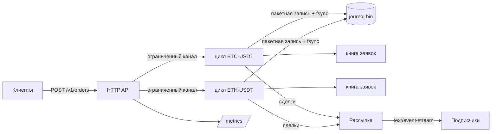

# orderbook-engine

Книга заявок и движок сопоставления на Go, устроенные так, как их делают биржи: один
однопоточный цикл на инструмент, журнал только на дозапись с групповым коммитом и поток
рыночных данных, который никогда не тормозит сопоставление.


| Уровень | Результат | Как измерено |
|---|---|---|
| Ядро книги | **3,62 млн заявок/с**, 0 аллокаций на операцию | `go test -bench SubmitMixed`, одно ядро |
| Движок, 4 инструмента | **1,01 млн команд/с** | `go test -bench EngineParallel`, 16 горутин |
| HTTP/JSON, асинхронный журнал | **95,6 тыс. запросов/с**, p99 4,9 мс | `cmd/loadgen`, 128 keep-alive соединений, тот же ноутбук |
| HTTP/JSON, fsync на каждый пакет | **28,9 тыс. запросов/с**, p99 6,1 мс | то же, в среднем 25,6 команды на один fsync |
| Холодный старт | **433 тыс. записей проигрываются за 96 мс** | лог сервера после перезапуска |

Железо: ноутбук Intel i7-13620H, Windows 11, генератор нагрузки на той же машине. На Linux с
клиентом на отдельной машине цифры выше.

## Почему быстро

- **Без блокировок на горячем пути.** Каждым инструментом владеет ровно одна горутина.
  HTTP-обработчики только ставят команду в очередь и ждут ответ в канале из `sync.Pool`.
- **Приоритет цены и времени, отмена за O(1).** Ценовые уровни лежат в двух кучах
  (максимум для покупок, минимум для продаж). Заявки внутри уровня образуют встроенный
  двусвязный список, поэтому отмена ничего не перебирает.
- **Целые тики и лоты.** В сопоставлении нигде нет плавающей точки, поэтому журнал
  воспроизводится бит в бит.
- **Пул объектов.** Исполненные и отменённые заявки возвращаются в список свободных,
  бенчмарк показывает ноль аллокаций на заявку.
- **Групповой коммит.** Цикл забирает до 512 команд из очереди, пишет их одним системным
  вызовом и одним `fsync`, затем применяет. Сохранность стоит один сброс на диск на пакет,
  а не на заявку.
- **Обратное давление вместо обвала задержки.** Очереди ограничены. Когда инструмент
  перегружен, API сразу отвечает `429`, и растёт `obe_rejected_total`.

## Архитектура



## Сохранность и восстановление

Каждая запись имеет вид `len | crc32c | body`. При старте движок проигрывает журнал в новые
книги, прежде чем принимать трафик. Если процесс упал посреди записи, оборванный хвост не
проходит проверку CRC и обрезается, поэтому в книге никогда не окажется половины заявки.
Оба пути покрывают `TestJournalReplayRestoresBook` и `TestRoundTripAndTornTail`.

## Корректность

`TestConservation` прогоняет 200 тыс. случайных заявок и отмен и проверяет, что количество
не появляется и не пропадает: выставлено = 2 × исполнено + отменено + в книге. Тесты
сопоставления фиксируют приоритет цены и времени, поведение IOC и рыночных заявок.

## API

```bash
# лимитная заявка (цена в тиках, количество в лотах)
curl -X POST localhost:8080/v1/orders -d '{"symbol":"BTC-USDT","side":"buy","type":"limit","price":10000,"qty":5}'

# отмена
curl -X DELETE localhost:8080/v1/orders/BTC-USDT/42

# агрегированный стакан
curl 'localhost:8080/v1/book/BTC-USDT?levels=10'

# сделки в реальном времени
curl -N 'localhost:8080/v1/stream?symbol=BTC-USDT'
```

Типы заявок: `limit`, `ioc`, `market`.

## Наблюдаемость

Метрики Prometheus на `/metrics`: команды, сделки, отклонённые команды, пакеты группового
коммита, подписчики SSE и гистограмма задержек по маршрутам. `docker compose up` поднимает
движок, Prometheus и готовый дашборд Grafana на `localhost:3000`.

## Запуск

```bash
make run      # сервер на :8080
make test     # юнит-тесты с детектором гонок
make bench    # микробенчмарки
make load     # нагрузочный тест по HTTP с перцентилями задержки
make up       # движок + Prometheus + Grafana
```

## Раскладка

```
cmd/server       точка входа, флаги, корректное завершение
cmd/loadgen      генератор нагрузки с замкнутым циклом, p50..p99.9
internal/book    книга заявок и сопоставление
internal/engine  однопоточные циклы, пакеты, обратное давление
internal/journal журнал команд с CRC и восстановлением оборванных записей
internal/feed    неблокирующая рассылка SSE
internal/api     HTTP-обработчики и метрики Prometheus
```

## Дальше

- Снимки состояния каждые N записей, чтобы ограничить время проигрывания
- Бинарный протокол поверх TCP рядом с JSON для клиентов в той же стойке
- Репликация журнала на горячий резерв
